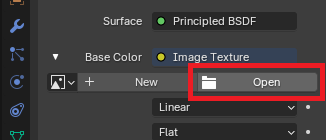
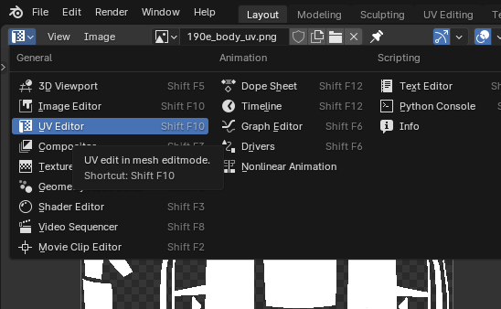

# Creating Car Body Kit Parts

## Preparation and Pack Creation

If you have already created a pack and want to add parts to it, you can skip this step.

There's no need to create a separate pack for each part; group them by type, manufacturers, etc.

To create a pack, refer to [this guide](CustomPartsPackCreation_EN.md).

# Model Creation

> [!NOTE]
> You can create the model in any 3D software that is convenient for you.

For convenience, you can dump the car model, excluding the part you want to create. Follow these steps to do so:

1. Go to the car dumping menu: `Tools -> Car dumper -> Dump model`
2. Disable the parts in the list that you do not need.
3. Dump the model by clicking `Dump selected parts`.

## Importing Models into Unity

To import models into Unity, you can drag the necessary files into the `Project` window or manually place them there via File Explorer.

After importing, select the desired model and navigate to the `Materials` tab in the `Inspector` window.

If the `Extract Textures` and `Extract Materials` buttons are grayed out and inactive, no action is needed.

If they are active, first extract the textures and then the materials.

> [!IMPORTANT]
> If you want to enable the ability to apply liveries to the object, in the `Model` tab, enable `Read/Write Enabled`.

Next, create a prefab by following these steps:

1. Create an empty object in the scene.
2. Reset its `Transform`.
3. Add the model to the newly created object.
4. Save the prefab and remove it from the scene.
5. Select the prefab in the `Project` window and double-click to enter editing mode.

Now you can proceed with creating the part.

## Creating Car Body Kit Parts

> [!NOTE]
> Kino Content SDK includes examples of all parts in the `Examples/ExteriorParts` folder. Be sure to review them for a better understanding of the process.

Available parts include:

* Front bumper
* Rear bumper
* Side skirts
* Doors
* Mirrors
* Hood
* Trunk
* Spoiler
* Roof
* Frame
* Exhaust

All parts are created using the same principle. Import the model into Unity, create a prefab, and configure the hierarchy.

Some parts may have additional components, as discussed [below](#configuring-the-prefab).

## Configuring the Prefab

> [!NOTE]
> It's crucial to set correct component names for the prefab, as this affects how it appears in the game.

Materials for the part:

* `body` - components with this name can be painted and will receive liveries (when [properly configured](#configuring-uv-mapping))
* `body_nolivery` - these components can only be painted

Additional components and materials:

* `mirrors` - name surfaces on **mirrors** that should reflect
* `Exhaust_root` - attachment point for exhaust, available only for **rear bumper**
* `Flame_root_<N>` - firing point, available only for **exhaust**. Replace `N` with a number `0-inf`, name the points sequentially.

## Configuring UV Mapping

For convenient UV mapping configuration, prepare a template by following these steps:

1. Create a new livery in the game.
2. Apply several stickers to completely cover the car from all sides.
3. Dump the resulting livery using Kino: `Tools -> Car dumper -> Dump livery`.

You will get something similar to this:

Now you can proceed to configure the UV mapping.

Create a material and set the texture as `Base Color`.

Specify the path to the UV texture.

Navigate to `UV Editor` and select the newly added texture.

Switch to `Edit Mode` and select the desired geometry.

Arrange the geometry on the UV map correctly.

Finally, export the model in `.FBX` or `.blend` format and [import](#importing-models-into-unity) it into Unity.
