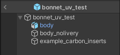
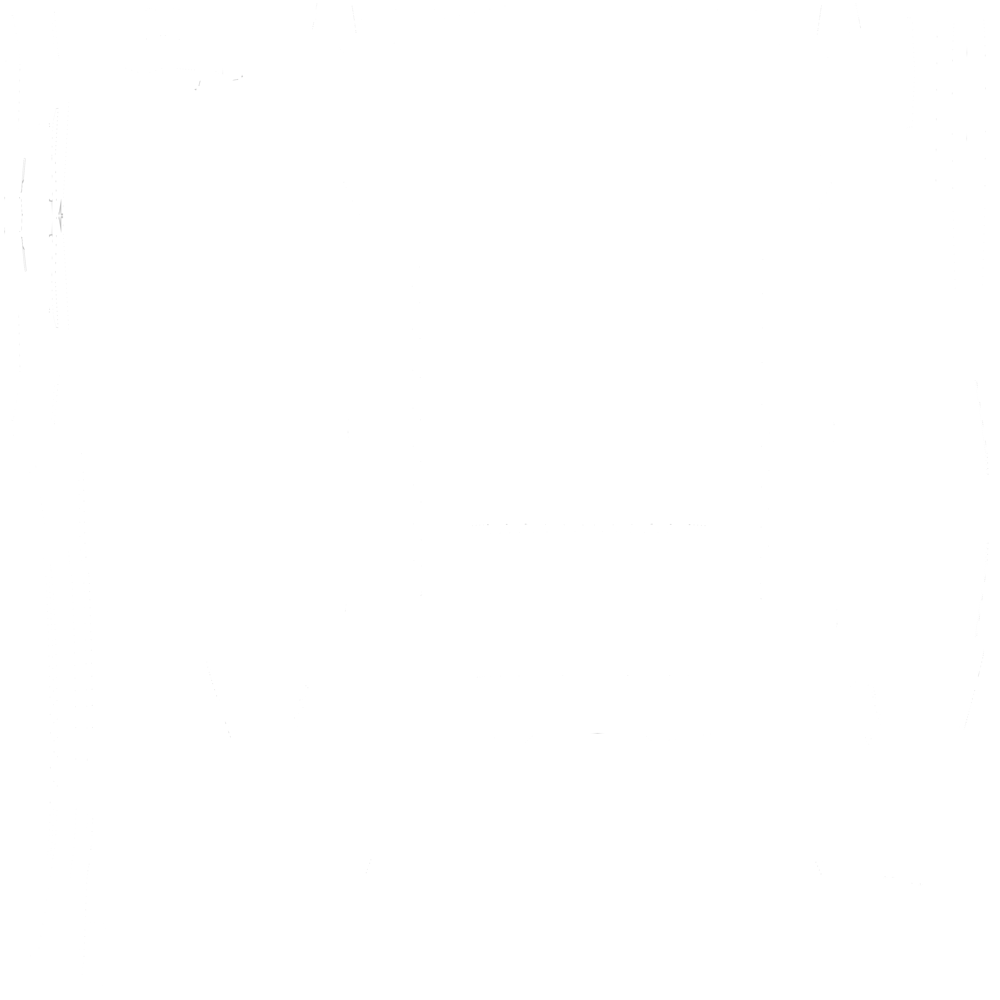

# Kino Content SDK

Make sure you have the latest version of [Kino Content SDK](https://github.com/trbflxr/kino_content_sdk/releases) installed.

If you already had the Kino Content SDK installed then make sure to update it by unpacking teh archive to the same folder with file replacement.

# Model creation

> [!NOTE]
> The model can be created in any 3D software you're accustomed with.

To make the process easier you can dump the CarX car model or the specific parts. Here's how you can do that:

1. Go to the car dump menu: `Tools -> Car dumper -> Dump model`
2. Disable the parts you don't need, or press deselect all and select the ones you want.
3. Dump the model by pressing `Dump selected parts`

# Parts pack creation

If you've already created the pack you can skip this step.

> [!IMPORTANT]
> You can and should add more parts to the same pack. The parts will be grouped inside their own category within the game's manu making them easier to use.

First of all you need to create a folder inside of the project. The folder must be inside the `Assets` folder. You can do it by clicking on an empty space in the **Project** window and going to `Create -> Folder`

Name the folder however you want, for an example **ExteriorParts**, then open it.

> [!NOTE]
> It is recommended to create a dedicated folder for each pack so that your project would be better organized and easier to work with

Then create a folder for the pack, for an example **190e_body_parts** and open it.

Then create metadata for the pack by clicking RMB on an empty space and going to `Kino -> Create car parts meta`

> [!WARNING]
> Metadata file has to be be named `__meta` (exactly)

Then fill out the base pack metadata. Each field has a tooltip, hover over it to get additonal information. 

> [!IMPORTANT]
> To create a pack with body kit parts you need to select `Car Parts` type. You **must** specify the car ID that the pack is intended for in the `Target car ID`.
> 
> You can check the ID of the currently selected car in the Kino menu: `Tools -> Developer tools`

## Unity model import

To import models in Unity you can drag and drop the needed files to the `Project` window or put manually put them there using the windows explorer.

After importing select the needed model and in the `Inspector` window switch to the `Materials` tab.

If `Extract textures` and `Extract Materials` buttons are grayed out and unclickable you can just go to the next step.

If the buttons are active, first extract the textures and then the materials.

> [!IMPORTANT]
> If you want to be able to put stickers on the part select `Red/Write Enabled` in the `Model` tab.

Now you need to create a `prefab` from this model.
You can do so by following these steps:

1. Create an empty object in the scene
2. Reset its `Transform`
3. Add the model to the created object
4. Save the prefab and delete it from the scene
5. Select the prefab in the `Project` windows and double click it to enter editing mode

Now you can get to creating the part

# Body kit parts creation

> [!NOTE]
> Kino Content SDK has examples of each part in the `Assets/Examples/ExteriorParts` folder. Make sure to examine them for a better understanding of the creation process.

Available parts:

* Front bumper
* Rear bumper
* Skirts
* Doors
* Mirrors
* Hood
* Trunk
* Spoiler
* Roof
* Rollcage
* Exhaust

All the parts are created using the same pattern. You need to import the model in Unity, create the prefab and set up the hierachy.

Some parts might have additional component. Morea bout it [bellow](#prefab-setup)

## Prefab setup

> [!NOTE]
> It's very important to use the correct naming for the prefab components as they will impact how it shows up in the game.

Parts materials:

* `body` - components using this name will be paintable and will have support for liveries (with the [correct setup](#setting-up-the-uvs))
* `body_nolivery` - these component will only be paintable.

Additional components and materials

* `mirrors` - reflective surface for the *mirrors*
* `Exhaust_root` - exhaust attachment root. Only available for the **rear bumper**
* `Flame_root_<N>` - backfire root. Only available for the **exhaust**. Replace the `N` with the number `0-inf`. Name the points in chronological order.

## Setting up the UVs

For an easier set up of the UVs it is recommended to prepare the template. To do that follow the steps bellow:

1. Create a new livery slot
2. Put some stickers to fully cover the paintable surface
3. Dump the livery using Kino: `Tools -> Car dumper -> Dump livery`

You should end up with something like this:

Now you can get with setting up of the UVs.

Create a material and assign a texture to it as a `Base Color`

Specify the path to the template texture

Go to the `UV Editor` and select the texture you've just added

Then go to the `Edit Mode` and select the desired geometry

Place the geometry on the UV map properly

Then export the model in an `.fbx` or `.blend` format and [import](#unity-model-import) it into Unity