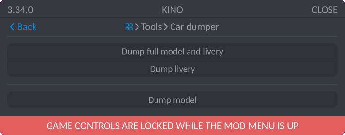
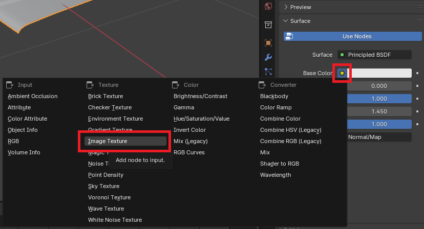

# Creating Car Body Kit Parts

## Content SDK

Before proceeding with the creation of parts, make sure that you have the latest version of the [ContentSDK](../ContentSDK/ContentSDKInstallation_EN.md).

If you already have ContentSDK installed, but it's not the latest version, update it using [this guide](../ContentSDK/ContentSDKUpdate_EN.md).

## Preparing and Creating the Pack

If you have already created a pack and want to add parts to it, you can skip this step.

You don't need to create a separate pack for each part; group them by types, manufacturers, etc.

To create a pack, use [this guide](CustomPartsPackCreation_EN.md).

# Creating the Model

> [!NOTE]
> You can create the model in any 3D software of your choice. In this example, `Blender` will be used.

### Preparation

Before starting, it is recommended to dump the car model, excluding the part you want to create. To do this, follow these steps:

1. Go to the car dump menu: `Tools -> Car dumper`.
2. Dump the model by clicking `Dump model`.

> [!IMPORTANT]
> Be sure to dump the `PartRoots`, as it will make it much easier to position objects correctly.

### Creation

When creating the model, set its **origin** to the position of the required **root**. The example below shows the correct positioning of the lights.

> [!IMPORTANT]
> Be sure to familiarize yourself with the [structure](CustomPartsStructure_EN.md) of the parts. The components of the part must be correctly named and placed.

Create the model according to the [structure](CustomPartsStructure_EN.md) of the required part, then proceed to export.

### Setting up UV Mapping

If you want to add livery overlays to your part, it needs to be properly mapped. If you don't plan to add livery overlays, you can skip this step.

For convenient UV mapping setup, it's recommended to prepare a template by following these steps:

1. Create a new livery in the game.
2. Apply several stickers to the car, ensuring it is **fully** covered from all sides.
3. Dump the resulting livery using Kino: `Tools -> Car dumper -> Dump livery`.

You will get something similar to this:

Now you can proceed to configure the UV mapping.

Create a material and set the texture as `Base Color`.

Specify the path to the UV texture.

Navigate to `UV Editor` and select the newly added texture.

Switch to `Edit Mode` and select the desired geometry.

Arrange the geometry on the UV map correctly.

### Export

You can save the `.blend` project directly into the `Assets` folder of ContentSDK, and if you have Blender integration set up, you can immediately start [importing the model](#importing-models-into-unity).

If you want to export only part of the project, select the desired parts and click `File -> Export -> FBX`.

In the export window, make sure to set the following settings:

Then export the model into the **Assets** subfolder in ContentSDK. After this, you can proceed with [importing](#importing-models-into-unity).

## Importing Models into Unity

To import models into Unity, you can drag the required files into the `Project` window or place them there manually via the file explorer.

After importing, select the desired model and in the `Inspector` window, go to the `Materials` tab.

If the `Extract Textures` and `Extract Materials` buttons are greyed out and not clickable, no further action is needed.

If they are active, first extract the textures, then extract the materials.

You can also set up [Blender integration](../Blender/BlenderIntegration_EN.md) for easier model importing.

> [!IMPORTANT]
> If you want to enable livery overlays on the object, in the `Model` tab, enable the `Read/Write Enabled` option.

## Prefab Preparation

After importing and preparing the model, you need to create a prefab for further configuration.

Create the prefab according to the instructions:

Afterward, you can proceed with additional prefab configuration. If everything is ready, you can start [packing the parts](CustomPartsCreation_EN.md#packing-parts).

> [!NOTE]
> If you want to add additional light sources (headlights, turn signals, etc.), proceed to [light source configuration](CustomPartsStructure_EN.md#light-source-configuration).
