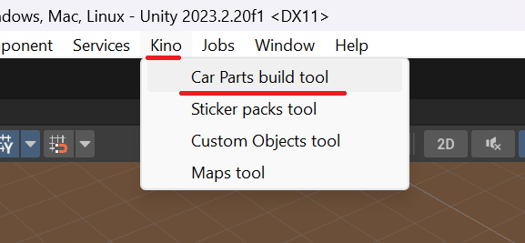
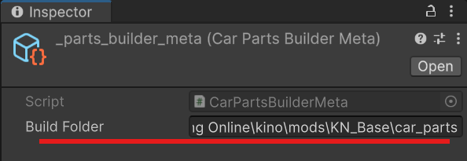

# Creating Custom Parts Packs

## Installing Unity and the Content SDK

Install the Unity editor using [this guide](../UnityInstallation/UnityInstallation_EN.md).

Then, install and configure the [Content SDK](../ContentSDK/ContentSDKInstallation_EN.md).

> [!NOTE]  
> There are example custom parts packs in the `Assets/Content/CarParts/Examples` folder that you can refer to.

## Creating Content

You can now start creating custom parts.

> [Wheels](CustomWheels_EN.md)

> [Body parts](CustomExterior_EN.md)

> [Interior](CustomInterior_EN.md)

> [Universal interior parts](CustomUniversalInterior_EN.md)

## Building Packs

Once you have finished creating the pack and filling out its metadata, you can proceed with building it.

If the build tool is not open, you can access it via the menu `Kino -> Car Parts build tool`.

You can drag the **Build tool** to any zone for ease of use.

If you see a message like this, click the button to create the metadata.

In the **Build Folder** field, you can specify any convenient folder. I have set the path to `KN_Base\car_parts` so that the finished packs are immediately installed in the game.

In the build tool window, select the resource packs you want to build using the `Selected to build` field. Then click the `Build for ...` button.

From this tool, you can also set author information, the build folder, and open settings for each parts pack.

After the build is complete, the finished packs will be placed in the folder you specified.
