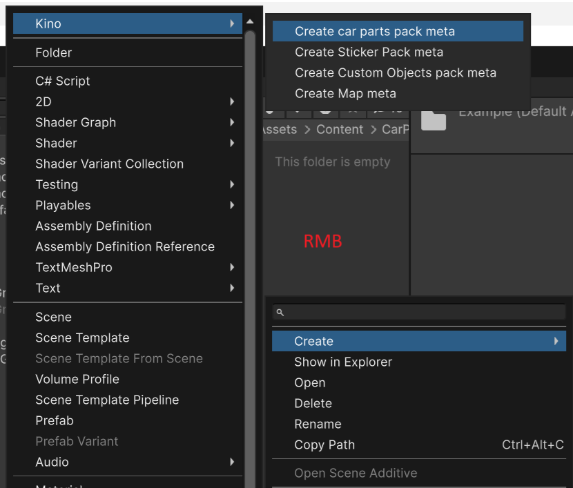
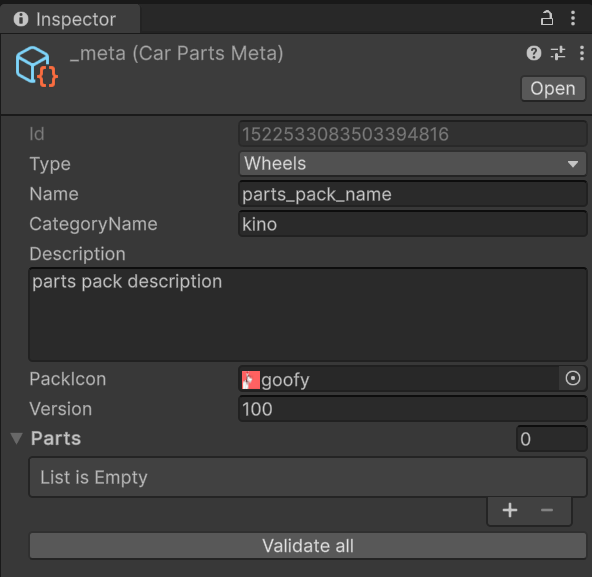

## Подготовка структуры проекта

Предполагается, что все паки деталей должны находиться в папке `Assets/Content/CarParts`.

Каждый пак должен находится в **своей** папке. Это повысит удобство и ускорит создание.

Пример структуры:

```
📂 Assets
 └ 📁 Content
    └ 📁 CarParts
       └ 📁 Examples
       └ 📁 MyWheelPack1
       └ 📁 MyExteriorPack1
       └ 📁 MyInteriorPack1
```

> [!IMPORTANT]  
> Создавайте новую папку в `CarParts` для каждого нового пака деталей.

## Создание метаданных пака

> [!IMPORTANT]  
> В данном примере будет использовано имя пака `Example`. Вы же называйте паки как хотите.

Для каждого нового пака необходимо создать **файл метаданных**. Для этого создайте и перейдите в папку нового пака. После чего создайте файл метаданных с помощью **контекстного меню**.



Структура должна выглядеть следующим образом:

```
📂 CarParts
 └ 📁 Example
    └ 📄 __meta
```

## Заполнение метаданных пака

Заполните метаданные о паке. Это нужно сделать **один раз** для **каждого** пака.



В поле **Type** укажите тип пака.

В поле **Name** укажите имя, оно должно быть уникальным и не должно содержать пробелов.

Укажите категорию в поле **CategoryName** имя категории, которое будет отображаться в интерфейсе игры, на карточке пака.

Добавьте описание пака в поле **Description**.

В поле **PackIcon** укажите иконку пака, которая будет отображаться на карточке в интерфейсе игры.

Поле **Version** отвечает за версию пака, пока что оставьте его как есть, со значением `100`.

> [!IMPORTANT]
> Для создания пака с деталями обвеса нужно выбрать тип `Car Parts`. **Обязательно** укажите ID авто, для которого предназначен этот пак, в поле `Target car ID`.
>
> Узнать ID текущего авто можно в меню Kino: `Tools -> Developer tools`
