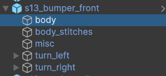
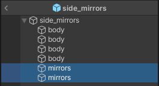
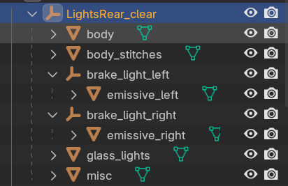
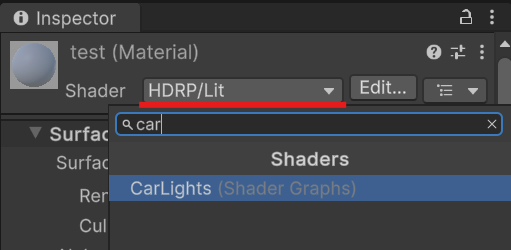
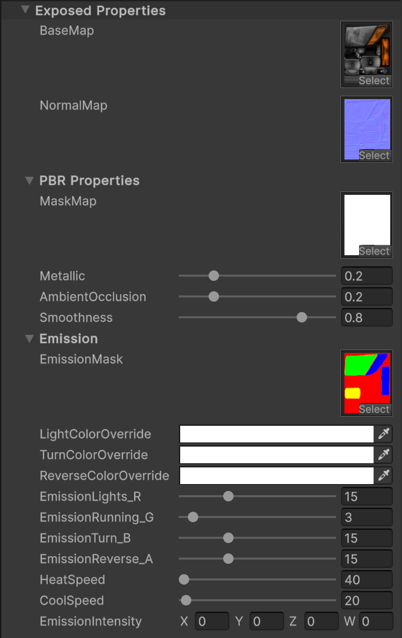
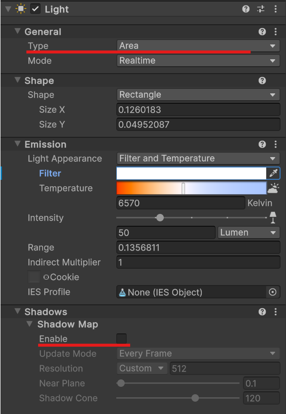
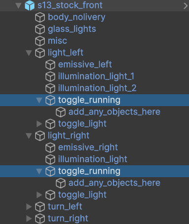
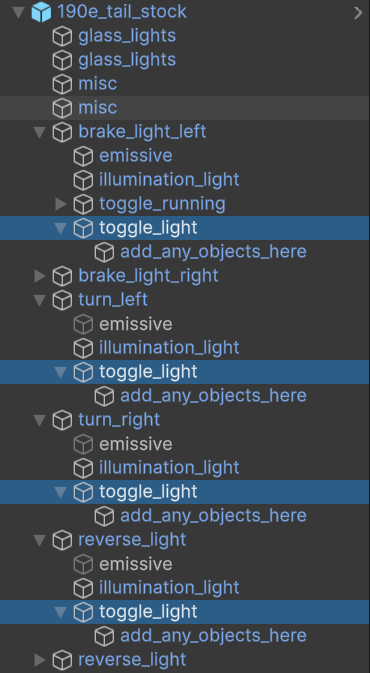
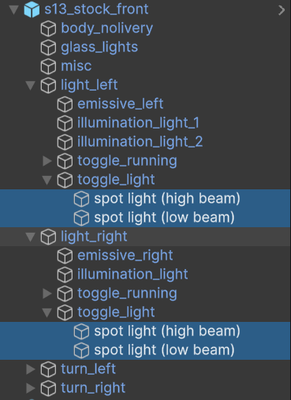
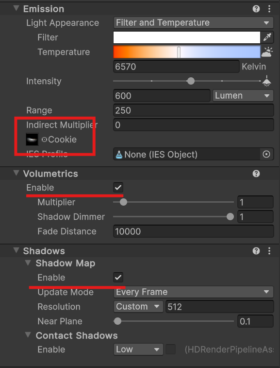

# Структура деталей

> [!TIP]
> В Content SDK есть хорошие примеры деталей для Silvia S13 и Mercedes 190e с исходными `.blend` файлами. В этих примерах наглядно показана структура деталей.

Условно детали можно поделить на два типа:
* Детали обвеса:
  * Боди кит (Шасси)
  * Передний бампер
  * Задний бампер
  * Пороги
  * Двери
  * Зеркала
  * Капот
  * Багажник
  * Спойлер
  * Крыша
  * Каркас
  * Выхлоп
* [Фары и фонари](#фары-фонари-поворотники)

Детали могут состоять из любого количества объектов и материалов.

У детали может быть несколько материалов, с которыми взаимодействует игра:
* `body` - Материал позволяющий красить деталь и наложение винилов.
* `body_nolivery` - Материал позволяющий только красить деталь.
* `glass_lights` - Материал позволяющий красить стекло. Доступен только для **фар** и **фонарей**.

Для добавления возможности покраски детали, Mesh, который вы хотите разрешить окрашивать в игре, должен иметь имя `body` или `body_nolivery`. 

> [!NOTE]
> Детали так же могут иметь **дополнительные компоненты**, некоторые можно добавлять ко всем типам деталей, а какие-то только к определенным.

Дополнительные компоненты:
* `mirrors` - Это поверхность зеркала, она будет иметь отражения. Доступно только для детали **Mirrors**.

Если назвать так объект, то его материал будет заменен на зеркальный. 

* `Exhaust_root` - Точка крепления выхлопа.

Эту точку можно добавить к любой детали, но обратите внимание, что она должна быть **одна**. Если на авто будет несколько деталей с _Exhaust_root_, то выхлоп добавится в первую по списку. 

* `Flame_root_<N>` - Точка эмитта партиклов выхлопа, огня, дыма.

Добавлять эту точку можно к любым объектам в любых местах, это не обязательно должен быть глушитель.
Вы можете создать _Hood dump_, выхлоп в _переднем крыле_, или бампер с предустановленным глушителем.

Замените `N` на число `0-inf`, называйте точки по порядку.

* `Фары, фонари, поворотники` - Дополнительные источники света. Их можно добавлять к **любой детали**.

Создание дополнительных источников света описано ниже.

# Фары, фонари, поворотники

Это так же дополнительные компоненты деталей, но они добавлены посредством Kino. Эти компоненты более гибкие в настройке, однако эта гибкость требует настройки.

На детали можно добавить следующие типы источников света:
* `light_left`, `light_right` - Фары, левая и правая. Активируются при включении _ходовых огней_ и _фар_.
* `brake_light_left`, `brake_light_left`, `brake_light` - Тормозные огни. Активируются при включении _ходовых огней_ и _нажатия на тормоз_.
* `turn_left`, `turn_right` - Индикаторы поворота. Активируются при включении _поворотников_ и _авариек_.
* `reverse_light` - Индикатор заднего хода. Активируется при включении задней передачи.

Эти компоненты можно добавлять в неограниченном количестве для любой из деталей.

> [!NOTE]
> Это базовые компоненты, которые активируются при определенных условиях. Но каждый из этих компонентов должен состоять из **определенных составных частей**.

## Составные части источников света

Каждый источник света работает по похожей логике с единственным различием в условии активации.

Составные части источников света:
* [emissive](#emissive) - Объект со светящимся материалом (CarLights shader). Может быть только один для каждого источника света.
* [illumination_light](#illumination_light) - Источник света для подсветки. Их может быть несколько, направлять их нужно на объект, для его подсветки.
* [toggle_running](#toggle_running) - Объект или группа, которая будет активна при активации `ходовых огней` или `фар`, или `нажатии на тормоз` в случае фонарей. Одна для каждого источника света.
* [toggle_light](#toggle_light) - Объект или группа, которая будет активна только при активации или `фар`, или `нажатии на тормоз` в случае фонарей. Одна для каждого источника света.

Составные части могут как называться именами представленными выше, так и иметь префикс.

Имена `emissive`, `emissive_left`, `illumination_light_123` и т.д. являются корректными и будут распознаны. Но имена `left_emissive`, `my toggle_light` и т.д. распознаны не будут. 

> [!NOTE]
> Все составные части являются опциональными, однако для работы источник света должен иметь **хотя бы одну** из них.

> [!IMPORTANT]
> Если вы находитесь на этапе создания модели, то сейчас достаточно дать её частям правильные имена и структуру.

Основная часть процесса настройки источников света будет происходить в `редакторе Unity`. На этапе моделирования нужно только правильно назвать части детали.

Когда модель будет готова, при необходимости настройте [UV-развертку](CustomExterior_RU.md#настройка-uv-развертки), затем [экспортируйте модель](CustomExterior_RU.md#экспорт).

После чего [импортируйте модель](CustomExterior_RU.md#импорт-моделей-в-unity) в Unity и [подготовьте префаб](CustomExterior_RU.md#подготовка-префаба).

## Настройка источников света

На этом этапе у вас уже должен быть создан **поефаб**. Перейдите в режим редактирования, дважды кликнув по префабу в окне `Project`.

### emissive

Для добавления свойств свечения объекту ему нужно присвоить материал с шейдером `CarLights`, который есть в проекте Content SDK.

Обратите внимание, что **emissive** объект, должен иметь корректный `UV-маппинг` и должен выглядеть корректно при наложении на него текстуры фар / фонарей.

> [!IMPORTANT]
> Очень важно разделять материалы для левой и правой стороны авто для корректной работы поворотников и фар.

В первую очередь нужно создать материал, для этого в окне `Project` откройте контекстное меню и выберете `Create -> Material`, после чего назовите его. Помните о разделении левой и правой стороны, вы можете сразу создать материал для противоположной стороны авто. 

Установите шейдер `CarLights` для созданного материала. Для этого выберете материал в окне `Project` и в окне `Inspector` откройте выбор шейдера.

Можете сразу установить созданные материалы объекты. В этом примере я устанавливаю левый и правый материалы на фары.

Теперь приступим к настройке материала. Для этого выберете его в окне `Project` и перейдите в окно `Inspector`.

> [!NOTE]
> Настройка левого и правого материалов идентична. Вы можете выбрать оба материала зажав `Ctrl` и настраивать их одновременно.
> Или же настройте их по очереди.

У материала с шейдером `CarLights` есть следующие поля:
* `BaseMap` - Это обычная diffusion текстура.
* `NormalMap` - Карта нормалей.
* PBR properties: 
  * `MaskMap` - Маска с PBR свойствами, подробнее о ней можно узнать [тут](https://docs.unity3d.com/Packages/com.unity.render-pipelines.high-definition@13.1/manual/Mask-Map-and-Detail-Map.html).
Так же на эту маску влияют множители описанные ниже.
  * `Metallic` - Множитель металлика материала.
  * `AmbientOcclusion` - Множитель AmbientOcclusion.
  * `Smoothness` - Множитель Smoothness.
* Emission:
  * `EmissionMask` - Маска эмиссии. Именно эта маска отвечает за то, как будет подсвечена текстура источника света. Подробности по созданию и настройке описаны в разделе [создание маски Emission](#создание-маски-emission).
  * `LightColorOverride` - Модификатор цвета свечения **фар** или **стоп-сигналов**, в зависимости от того фары это или фонари.
  * `TurnColorOverride` - Модификатор цвета **поворотников**.
  * `ReverseColorOverride` - Модификатор цвета сигнала **заднего хода**.
  * `EmissionLights_R` - Интенсивность свечения зоны **фар** или **стоп-сигналов**, в зависимости от того фары это или фонари.
  * `EmissionRunning_G` - Интенсивность свечения **ходовых огней**.
  * `EmissionTurn_B` - Интенсивность свечения **индикаторов поворота**.
  * `EmissionReverse_A` - Интенсивность свечения *сигнала **заднего хода**.
  * `HeatSpeed` - Множитель отвечающий за то, на сколько быстро будет достигнута **пиковая яркость** свечения.
  * `CoolSpeed` - Отвечает за то, как быстро будет **затухать** свечение после отключения.
  * `EmissionIntensity` - Этот параметр управляется Kino. Вы можете использовать его для предпросмотра свечения. Его значения **не будут сохранены**.

Множители `HeatSpeed` и `CoolSpeed` могут использоваться что бы достичь эффекта **галогеновых** ламп, которые быстро нагреваются, но остывают медленнее.

> [!NOTE]
> Модификаторы цвета нужны для задания конкретного цвета свечения. Изначально они **белые**, это означает, что свечение будет аналогично цвету `BaseMap`.
> 
> Однако при создании на пример **clear фонарей** цвет текстуры будет белым, а стоп-сигналы _обычно_ красные. Для этого и нужен модификатор цвета. Вы можете установить в `LightColorOverride` **красный** цвет для корректного свечения. 

#### Создание маски Emission

Emission маска отвечает за зоны подсветки. По сути это обычная текстура, которая, как и любая другая состоит из 4х каналов: красного (R), зеленого (G), синего (B) и альфа-канала (A).

Каналы Emission:
* `R` - Красный канал отвечает за подсветку **фар** и **стоп-сигналов**.
* `G` - Зеленый канал подсвечивает **ходовые огни**.
* `B` - Синий канал отвечает за подсветку **индикаторов поворота**.
* `A` - Альфа отвечает за подсветку **индикатора заднего хода**.

Для создания маски вы можете использовать любой софт для редактирования фото. Это может быть Photoshop, Gimp, в этом примере будет использован онлайн редактор [Photopea](https://www.photopea.com/).

В примере будет показано создание маски для фонарей, так как в них используется `A канал`. При создании фар используются только `RGB` каналы, так на фарах не может быть **индикатора заднего хода**.

1. Для удобства можете загрузить **diffusion** текстуру и сделать её менее прозрачной, что бы было проще зарисовывать зоны подсветки.
2. Создайте **новый слой** и залейте его **черным цветом**.
3. Любым удобным способом зарисуйте на этом слое нужные **зоны подсветки**, в соответствии с **каналами**, которые описаны выше.
Если какая-то зона должны подсвечиваться в **нескольких каналах**, то скомбинируйте их. На пример зона будет подсвечиваться при активации **ходовых огней** и нажатия на **тормоз** - тогда её нужно закрасить **желтым** цветом (`R` + `G` = `Yellow`).
4. Перейдите в меню `Channels` и добавьте **новый слой**.
5. На новом слое (`Alpha`) зарисуйте **белым** цветом зоны подсветки **сигнала заднего хода**.
6. Отключите отображение слоя **diffusion**, что бы видно было только слой с **маской**.
7. Сохраните файл либо в формате `PSD`, либо экспортируйте в формате `TIFF`.
8. Поместите маску в папку с **проектом**. После чего **установите** её в настройках **материала**.

### illumination_light

Это дополнительные объекты с компонентами `Light`, которые нужны для дополнительной **подсветки**.

Объектов `illumination_light` может быть несколько для каждого источника света (под источниками света подразумеваются фары, стоп-сингалы, поворотники и т.д.)

Как было упомянуто выше каждый объект `illumination_light` обязательно должен содержать компонент `Light`.

Тип источника света может быть только `Spot`, `Point`, `Area`. Так же обязательно **отключите** `Shadow Map` и `Volumetrics`, если такие опции доступны, это значительно улучшит производительность.

Так же вы можете настроить **цвет** подсветки, её **яркость** и **дальность**. Однако обратите внимание, что цвет подсветки **фар** будет **перезаписан** пользовательским, который у него установлен в контроллере света в Kino.

> [!IMPORTANT]
> Старайтесь добавлять как можно меньше `illumination_light` что бы как можно меньше влиять на производительность игры.

### toggle_running

Этот объект будет переключаться в зависимости от текущего состояния фар. У каждого источника света может быть только один объект `toggle_running`, а может и не быть вовсе.

Объект `toggle_running` будет активен при активных **ходовых огнях** и / или включенных **фарах**.

Однако обратите внимание, что этот объект может быть только у **фар** и **фонарей**, у индикаторов поворота и заднего хода этого объекта быть **не может**.

Вы можете добавить в `toggle_running` сколько угодно других объектов и вся эта группа будет переключаться в зависимости от текущего режима фар.

### toggle_light

Этот объект будет активен только при **включенных фарах**, **нажатом тормозе**, активном индикаторе **поворота** или **заднего хода**.

У каждого источника света **опционально** может быть только один объект `toggle_light`.

При создании фар именно в объект `toggle_light` необходимо добавлять объекты с компонентами `Light` и типом `Spot`.

Именно эти источники света будут освещать область перед машиной.

#### Настройка источников света для фар

При создании источников света фар вы так же можете настроить несколько важных параметров.

Вы можете установить источники света под **нужным углом**, так что бы фары светили на дорогу, а не просто вперед, установить **дальность освещения**.

В проекте есть два типа масок `head_lights_mask_left` и `head_lights_mask_right` для **леворульных** и **праворульных** авто.

Обязательно установите их в поле `Cookie`, для предания дополнительных деталей вашим фарам.

Так же вы можете включить **тени** и взаимодействие с **Volumetric** для источников света фар.

> [!IMPORTANT]
> Если у ваших фар несколько источников света, то включайте **тени** и **Volumetric** только для одного из них, так как эти параметры очень сильно влияют на производительность.

#### Дополнительные метаданные для фар и фонарей

Вы можете задать дополнительные параметры для фар и фонарей:
* `Override Turn Signals` - При активации этой опции Kino **не будет добавлять** стандартные источники света для индикаторов поворота. Рекомендуем **включить** эту опцию.
* `Override Headlights Mask` - Если опция активна, то в качестве маски фар будет использоваться та, которую вы установили в поле `Cookie` для источников света фар. Рекомендуем **включить** эту опцию.
* `Override BrakeLight` - При активации позволяет **отключить** стандартный источник света **стоп-сигналов**.

