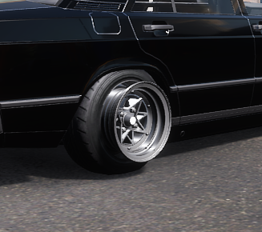
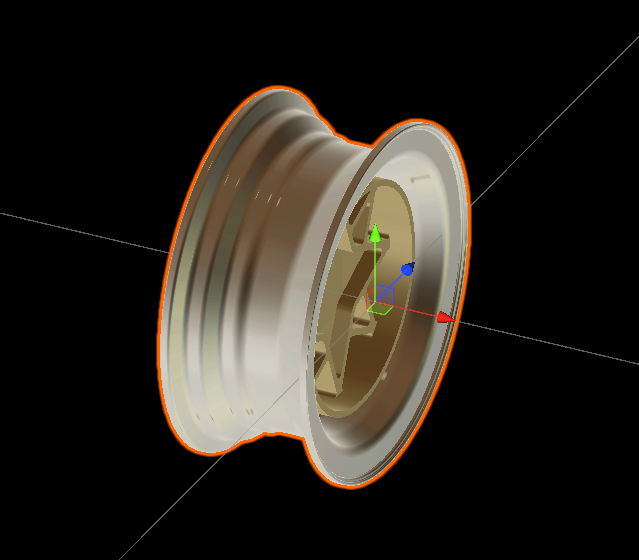

# Создание кастомных дисков

[!IMPORTANT]
> Перед началом, убедитесь, что у вас установлен и настроен `kino_content_sdk`, подробнее по [ссылке](https://github.com/trbflxr/kino/blob/master/ContentCreation/CustomCarPartsCreation_RU.md).

## Подготовка пака

Если вы уже создали пак, то этот шаг можно пропустить.

[!NOTE]
> Рекомендуется создавать папку для каждого пака, для нормальной организации проекта.

[!IMPORTANT]
> В пак можно и даже нужно добавлять несколько дисков. Тогда эти диски будут сгруппированы в своей категории в меню игры и пользователям будет удобнее их использовать.

Первым делом нужно создать папку внутри проекта. Папка должна находится внутри папки `Assets`. Для этого кликните правой кнопкой по пустому месту в окне **Project**, и создайте папку `Create -> Folder`.

Назовите папку как вам угодно, на пример **Wheels**, и перейдите в неё.

[!NOTE]
> Если вы планируете создавать несколько паков с дисками, то рекомендуется для каждого из них создавать свою папку.

Далее создайте папку для пака, на пример **wheels_pack1** и перейдите в неё.

Затем создайте метаданные для пака, нажав ПКМ по пустой области и выбрав `Kino -> Cerate car parts meta`.

[!WARNING]
> Файл метаданных обязательно должен называтся `__meta` и никак иначе.

После заполните базовые метаданные пака. У каждого поля есть тултип, наведите курсор на него, что бы узнать более подробную информацию.

1. Тип пака, в данном случае `Wheels`
2. Название пака, имя должно быть в нижнем регистре, только латиницей, допускаются цифры и `_`, имя должно быть **без пробелов**.
3. Название категории. Опционально можно указать название, которое будет отображаться в интерфейсе игры, на карточке пака.
4. Описание пака.
5. Иконка. Поле опциональное, однако мы рекомендуем не оставлять его пустым.
6. Версия пака. Пока что не используется, оставьте как есть.

Подготовка пака завершена, можно [создавать](#создание-модели-диска) и [импортировать](#импорт-моделей-в-unity) модели.

## Создание модели диска

[!NOTE]
> Если вы занимались созданием дисков для воркшопа, то этот шаг можно пропустить и перейти к [импорту в Unity](#импорт-моделей-в-unity)

В гайде будет показан пример для `Blender`, если вы используете другой софт для моделирования, то шаги там будут примерно такими же.

После того как вы создали модель диска его нужно подготовить к экспорту.

[!IMPORTANT]
> Диск должен быть расположен лицевой стороной по направлению оси `X`.

[!IMPORTANT]
> Диск должен состоять минимум из двух частей: `rim` и `spokes`, названия должны быть именно такими. А так же эти части не должны иметь текстур.

Однако у диска может быть более двух компонентов, и их уже можно называть как угодно. также их можно текстурировать.

В примере ниже у диска есть компонент `wheel_nuts`.

[!IMPORTANT]
> Так же обратите внимание на смещение диска относительно нулевых координат. Диск будет установлен на ступицу точкой центральной точкой части `spokes`. Имейте это ввиду и при необходимости диск можно подвинуть в том или ином направлении по оси `X`.

Теперь диск нужно подогнать под игровые размеры. Для этого импортируйте на сцену модель для фитмента, которая находится в папке `kino_content_sdk/FitmentModels` и подгоните размеры вашего диска под размер примерочной модели.

После чего диск можно экспортировать. Убедитесь, что параметры для секции `Transform` указаны такие же как и на изображении.

Так же, если на сцене есть сторонние объекты, и вы не хотите что бы они попали в модель, вы можете выбрать одну из опций `Limit to`. Однако лишние компоненты можно будет уже в Unity после создания префаба.

По завершению экспорта можно приступать к импорту модели в Unity.

## Импорт моделей в Unity

Для импорта моделей в Unity вы можете перетащить нужные файлы в окно `Project` или поместить их туда вручную, через проводник.

После импорта выберите нужную модель и в окне `Inspector` перейдите на вкладку `Materials`.

Если кнопки `Extract Textures` и `Extract Materials` серые и некликабельные, то ничего делать не нужно.

Если же они активны, то сперва извлеките текстуры, а после материалы.

Теперь вам необходимо создать `префаб (prefab)` из этой модели. Для этого выполните следующие действия:

1. Перетащите модель в иерархию сцены (`Hierarchy`)
2. Убедитесь что у компонента `Transform` установлены значения такие же как и на скрине ниже

3. Теперь для создания префаба перетащите модель из окна `Herarchy` а окно `Project`, к исходной модели и выберите `Original Prefab`

4. Префаб готов к использованию

## Добавление дисков в пак

[!WARNING]
> Если на этом этапе вы всё ещё не создали метаданные для пака, то сделайте это по [инструкции выше](#подготовка-пака).

Для того что бы диски стали доступны в игре их нужно добавить в пак. Сделать это очень просто.

1. В окне `Project` выберите ранее файл `__meta`

2. После чего добавьте слот под диск в список нажав на `+`
3. Заполните поля, как на примере ниже

[!NOTE]
> Обратите внимание, что в поле `Replacement Id` я указал значение `111`, так как именно этот диск **из стандартного набора** игры максимально похож на тот, который я добавил.

### Replacement Id

Опциональное, но крайне желательное к заполнению поле. Нужно для того, что бы у людей, у которых нет **Kino** или **этого пака** на машину установилась максимально похожая стандартная деталь.

## Сборка пака

Заключительным этапом является сборка пака.

Процесс сборки описан для всех типов паков [тут](https://github.com/trbflxr/kino/blob/master/ContentCreation/CustomCarPartsCreation_RU.md).

---

## Проблемы с отображением в игре

Если после загрузки дисков в игру их не видно, или они повернуты неверно, то это очень просто исправить.

Перейдите в режим редактирования дважды кликнув по необходимому префабу в окне `Project`.

### Проблемы с масштабом (не видно диск)

Убедитесь, что у корневого объекта (в данном случае `crooked_ssr`), у компонента `Transform`, в полях `Scale` установлено **1**.

После чего выделите все объекты внутри корневого и обратите внимание на параметр `Scale` у компонента `Transform`.

Если выделали всё по гайду, то в поле масштаб у вас будет значение больше или равно единицы (1).
Однако если вы видите значения ниже единицы, то установите в поля `Scale` значение **1**, сохраните префаб, пересоберите пак и проверьте в игре.

Таким образом подберите правильный масштаб.

### Диск неправильно повёрнут

Перейдите в редактирование префаба, и обратите внимание в какую сторону направлен диск.
Правильное положение диска должно выглядеть так. Диск должен смотреть в обратном направлении по оси `X`, как это показано ниже.

Если у вас диск расположен иначе, то выберите все объекты внутри корневого и поверните их правильно.

В данном случае значение `-90` по оси `Y` исправили проблему.

### Диск имеет неверное смещение

Если у диска в игре некорректный вылет или он смещён по какой-то оси, то это очень просто исправить.

Выберите нужный префаб и даблкликом перейдите в режим редактирования. Затем выберите все объекты внутри корневого и обратите внимание на параметр `Position` у компонента `Transform`.

Игра будет крепить диск к ступице (wheel hub) точкой, которая установлена в объекте `spokes`. На скрине выше видно, насколько эта точка выдвинута, от того в игре посадка у диска некорректная.

Подвиньте все объекты внутри корневого что бы на расстояние нужное для компенсации смещения.

В данном случае значение `0.071` по оси `X` исправило ситуацию.

После сохраните префаб и пересоберите пак.