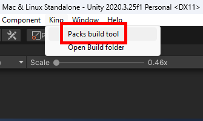
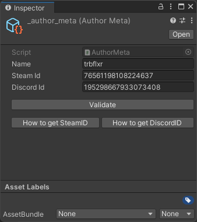
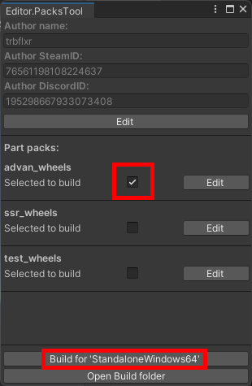

# Custom parts bundle creation

## Unity installation

If y you already have Unity installed, make sure the editor version is `2020.3.25.f1`. Otherwise downloaded the required version using the guide provided bellow.

Install the Unity editor by following [this guide](https://github.com/trbflxr/kino/blob/master/ContentCreation/UnityInstallation/UnityInstallation.md)

## SDK Installation

If you already have `kino_content_sdk` installed then you can skip this step.

1. Donwload and unpack anywhere you want [kino_content_sdk](https://github.com/trbflxr/kino_content_sdk/releases).

2. Add `kino_content_sdk` to UnityHub

3. Open the project and wait for it to load

## Content creation

Now get to creating custom parts.

> [Rims](https://github.com/trbflxr/kino/blob/master/ContentCreation/CustomCarParts/CustomWheels_EN.md)

> [Steering wheels (TBA)]()

## Building the bundle

After you finish creating the bundle and fill out its metadata you can get to bulding the bundle.

Bundle building happens using the **PacksTool**. To open it go to:

## Setting up the building tools

On the first start you might have some data missing and SDK will offer you to generate it.

> [!NOTE]
> If you already have set up the tools before, you can skip this step.

At the moment the building tools window looks like this.

At the upper part you can check the information about the creator (you). If the fields are emtpy press the `Edit` to open the editor.

Fill out the information about the pack creator.

If you don't know how to get SteamID or DiscordID, use the buttons bellow to open the guide.

## Starting the build

Put checkmarks on the packs you want to build and press `Build for ...` at the bottom of the **PacksTool** window.

Once the build is finished you can find the bundles inside the `📁 Build` folder that you can access by pressing the `Open Build folder` button, or by going to
> `Kino`  
> └ `Open Build folder`