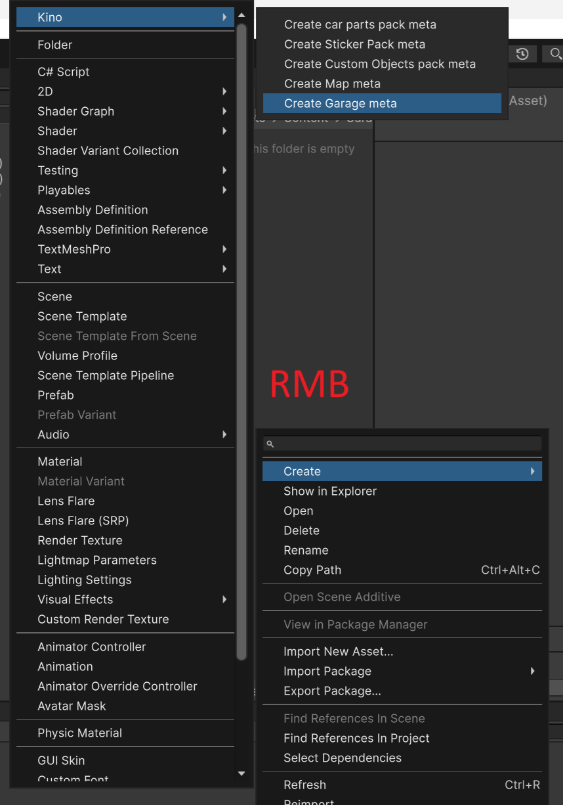
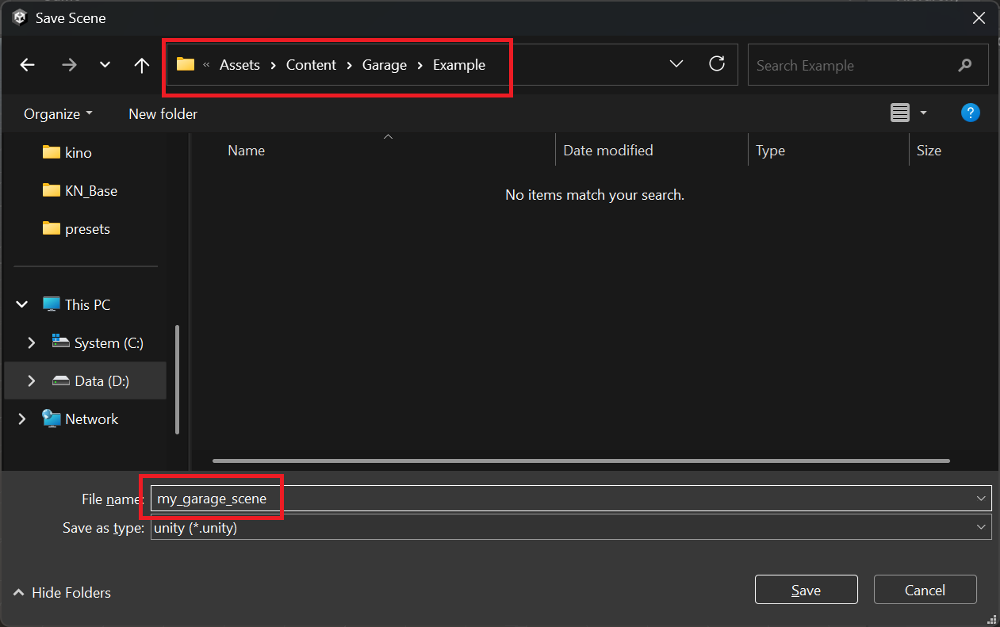
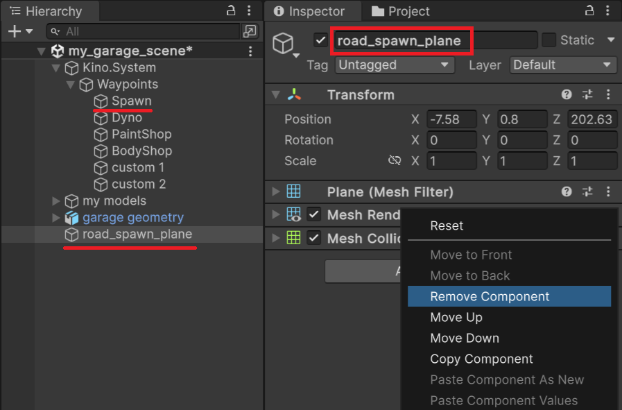
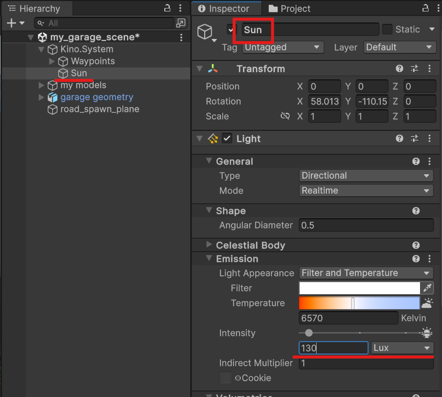
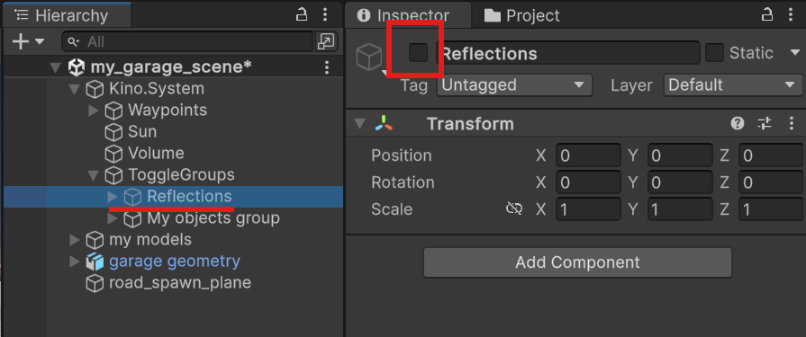
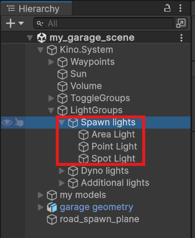
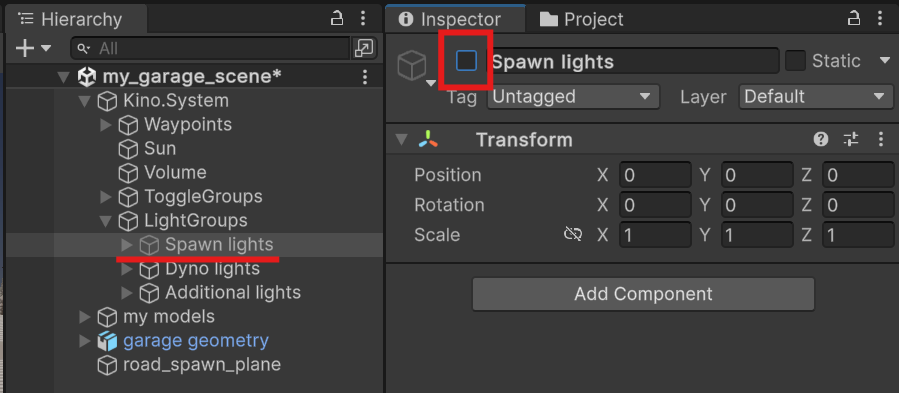
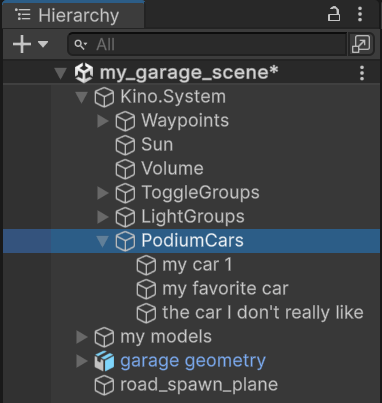
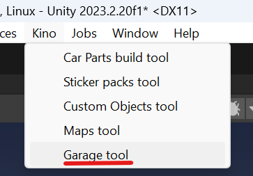

# Создание кастомных гаражей

## Установка Unity и Content SDK

Установите редактор Unity используя [этот гайд](../UnityInstallation/UnityInstallation_RU.md).

Затем установите и настройте [Content SDK](../ContentSDK/ContentSDKInstallation_RU.md).

> [!NOTE]  
> В папке `Assets/Content/Garage/Example` есть пример гаража и вы можете с ним ознакомиться.


## Подготовка структуры проекта

Предполагается, что все гаражи должны находиться в папке `Assets/Content/Garage`.

Каждый гараж должен находится в **своей** папке. Это повысит удобство и ускорит создание.

Пример структуры:

```
📂 Assets
 └ 📁 Content
    └ 📁 Garage
       └ 📁 Example
       └ 📁 DRO1_Garage
       └ 📁 MyGarage
```

> [!IMPORTANT]  
> Создавайте новую папку в `Garage` для каждого нового гаража.

## Создание метаданных гаража

> [!NOTE]  
> В данном примере будет использовано имя гаража `Example`. Вы же называйте гаражи как хотите.

Для каждого нового гаража необходимо создать **файл метаданных**. Для этого создайте и перейдите в папку нового гаража. После чего создайте файл метаданных с помощью **контекстного меню**.



Структура должна выглядеть следующим образом:
```
📂 Garage
 └ 📁 Example
    └ 📄 __garage_meta
```

## Заполнение метаданных гаража

Заполните метаданные о гараже. Это нужно сделать **один раз** для **каждого** гаража.


Заполните поля метаданных гаража.

Поле **Scene** пока что оставьте пустым, мы вернемся к нему позже.

## Создание сцены

Нажмите `File -> New Scene` или `Ctrl + N` и выберите шаблон `Empty`.

Затем нажмите `File -> Save` или `Ctrl + S` что бы сохранить только что созданную пустую сцену.



Теперь выберите файл метаданных гаража `__garage_meta` и установите только что сохраненную сцену в поле `Scene`.


### Добавление моделей

Любым удобным для вас способом создайте и загрузите модели. После чего перетащите их на сцену и расположите в желаемых местах.

На данном этапе ваша сцена должна выглядеть как-то так:


### Добавление системных объектов

Создайте в корне сцены пустой объект с именем `Kino.System`. Для этого нажмите правой кнопкой мыши по пустому пространству в окне `Hierarchy` и выберите `Create Empty`, после чего назовите созданный объект `Kino.System`.

На данном этапе ваша сцена должна выглядеть как-то так:


Система гаражей Kino предполагает наличие следующих системных объектов:
* [Waypoints](#точки-спавна-waypoints) - Обязательный объект содержащий точки спавна.
* [Sun](#солнце-или-луна-sun) - _Опциональный_ объект солнца или луны, отвечает за освещение.
* [Volume](#настройки-графики-volume) - Обязательный объект отвечающий за работу графики и пост-эффектов.
* [ToggleGroups](#группы-объектов-togglegroups) - _Опциональный_ объект со списком групп объектов, которые пользователь сможет переключать в игре.
* [LightGroups](#группы-источников-света-lightgroups) - _Опциональный_ объект со списком групп источников света, которы будут доступны к настройке в игре.
* [PodiumCars](#подиумные-авто-podiumcars) - _Опциональный_ объект с точками спавна "подиумных" авто.

> [!NOTE]  
> Для работы _контроллера отражений Kino_ добавьте на сцену `Reflection Probe` и настройте её область покрытия.

### Точки спавна (Waypoints)

Добавьте в объект `Kino.System` новый пустой объект, нажав на него правой кнопкой мыши, и выбрав `Create Empty`, после чего назовите новый объект `Waypoints`. В этом объекте должны находится все доступные точки спавна.

Создайте желаемые точки спавна в соответствии с [наименованием](#наименование-точек-спавна) и переместите их в нужные места.

#### Наименование точек спавна

Вы можете называть точки как угодно, однако есть ряд точек, которые будут использоваться системой Kino:
* `Spawn` - Обязательная основная точка спавна, на ней игрок будет находиться в главном контексте гаража.
* `Dyno` - _Опциональная_ точка диностенда.
* `BodyShop` - _Опциональная_ кастомизации бадикитов.
* `PaintShop` - _Опциональная_ для покраски и редактора ливрей.

> [!NOTE]  
> Обратите внимание, что если у игрока активна опция авто-перемещения, то в зависимости от контекста он будет перемещен на одну из _дополнительных_ точек спавна, таких, как `Dyno`, `BodyShop`, `PaintShop`.
> Однако эти точки не обязательны и вы можете добавить только основную точку `Spawn`.

#### Коллайдеры точек спавна

Для того что бы авто игрока не проваливалось сквозь пол необходимо создать коллайдер.

Для этого добавьте в корень сцены объект `Plane`, нажмите по пустому пространству в окне `Hierarchy` правой кнопкой мыши и выберите `3D Object -> Plane`.

> [!IMPORTANT]  
> Назовите созданный объект `Plane` любым удобным именем, но **обязательно** добавьте префикс `road_` что бы Kino установил ему коллайдер.

Расположите только что созданный `Plane` в месте где должно спавнится авто игрока. А так же удалите с него компонент `Mesh Renderer`, что бы его не было видно.



Аналогичным образом создайте остальные точки спавна (если они нужны), добавьте их в группу `Waypoints`, назовите в соответствии с [наименованием](#наименование-точек-спавна), а так же добавьте коллайдеры.

### Солнце или Луна (Sun)

Это опциональный объект, если у вашего гаража нет окон и он представляет собой полностью закрытую коробку, то этот объект можно пропустить. Во всех остальных случаях `Sun` Добавить стоит.

Для этого нажмите правой кнопкой мыши по `Kino.System`, выберите `Light -> Directional Light` и назовите новый объект `Sun`.

Настройте желаемое вращение солнца, задайте цвет и температуру, а так же для корректной работы игры - установите ему яркость **не выше** 150 lux.



### Настройки графики (Volume)

За графику отвечает объект `Volume`, создайте его в `Kino.System`, для этого нажмите по нему правой кнопкой мыши и выберите `Volume -> Sky and Fog Global Volume`, и назовите новый объект `Volume`.

Настройте существующие эффекты (можете отключить их, если они вам не нужны), или добавьте новые, нажав `Add Override`.


> [!NOTE]  
> Обратите внимание, что гараж будет выглядеть в игре так, как вы его настроите в редакторе, включая все эффекты пост обработки.
> 
> Но так же наличие компонентов `Sun` и `Volume` позволит игрокам самим настраивать графику в гараже с помощью Kino.

### Группы объектов (ToggleGroups)

Объект `ToggleGroups` является опциональным и позволяет добавить в гараж группы, которые пользователь сможет переключать в игре. В группы можно добавить что угодно, на пример отражения, дополнительные объекты или источники света.

Для добавления `ToggleGroups` выберите системный объект `Kino.System`, затем нажмите по нему правой кнопкой мыши и выберите `Create Empty`, после чего назовите новый объект `ToggleGroups`.

Группы нужно добавлять непосредственно в объект `ToggleGroups`, точно так же создав пустой объект. Имя групп может быть любым, количество не ограниченно.


Вы можете отключить (скрыть) группы, убрав галочку в инспекторе, таким образом группа по дефолту будет не активной, и пользователю нужно будет включить её вручную. 



### Группы источников света (LightGroups)

Объект `LightGroups` является опциональным и позволяет назначить источники света в настраиваемые группы, которые пользователь сможет переключать и кастомизировать в игре. В группы можно любые источники света, **кроме** `Directional`.

Для добавления `LightGroups` выберите системный объект `Kino.System`, затем нажмите по нему правой кнопкой мыши и выберите `Create Empty`, после чего назовите новый объект `LightGroups`.

Группы нужно добавлять непосредственно в объект `LightGroups`, точно так же создав пустой объект. Имя групп может быть любым, количество не ограниченно.

> [!NOTE]  
> Обратите внимание, что для игроков будет доступна настройка интенсивности, цветовой температуры и цвета источников света.
> Настройки будут примениться ко всей группе.



Вы можете отключить (скрыть) группы, убрав галочку в инспекторе, таким образом группа по дефолту будет не активной, и пользователю нужно будет включить её вручную.



### Подиумные авто (PodiumCars)

Объект `PodiumCars` является опциональным и позволяет назначить точки спавна подиумных авто. Под "подиумными" авто имеются ввиду автомобили игрока, которые будут загружаться вместе с гаражом. Пользователь сможет установить любые авто с любым пресетом на подиум.

Для добавления `PodiumCars` выберите системный объект `Kino.System`, затем нажмите по нему правой кнопкой мыши и выберите `Create Empty`, после чего назовите новый объект `PodiumCars`.

Точки спавна нужно добавлять непосредственно в объект `PodiumCars`, точно так же создав пустой объект. Имя точки может быть любым, количество не ограничено. Однако имейте ввиде, что дополнительные авто затрачивают дополнительные ресурсы, что повлечет за собой снижение FPS и повышение времени загрузки гаража.



> [!IMPORTANT]  
> Так же имейте в виду, что под каждой точкой спавна должен быть коллайдер, иначе авто провалится под землю. Вы можете создать его по анологии с [коллайдером точки спавна](#коллайдеры-точек-спавна).
> 
> Если ваши точки находятся на одной плоскости, то вы можете создать один большой `Plane`, вместо того, что бы добавлять индивидуальный для каждой точки. 

## Сборка гаража

Откройте окно инструмента сборки гаражей, выбрав `Kino -> Garage tool`.



В появившемся окне выберите гараж, который хотите собрать и нажмите на кнопку `Build for <platform name>`


