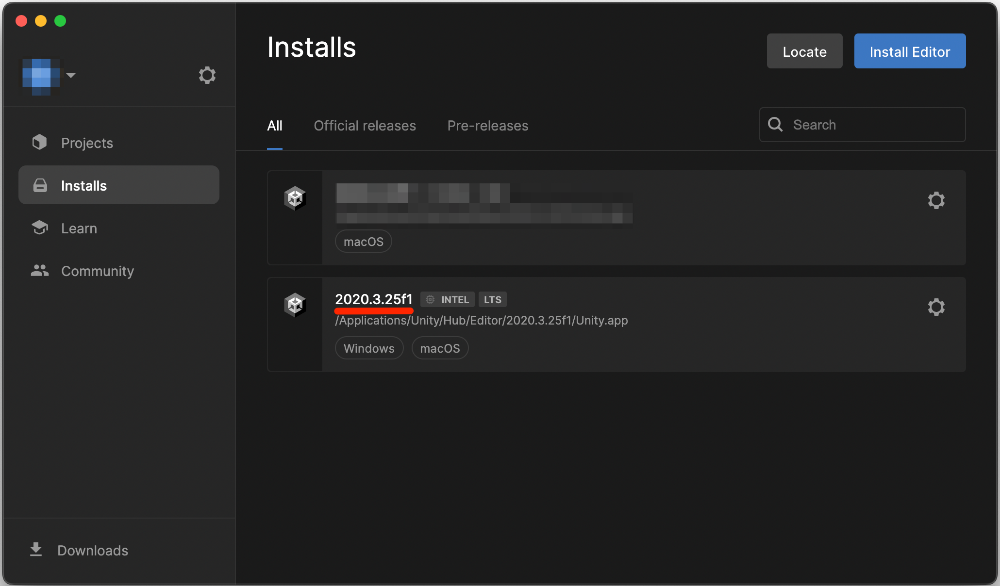
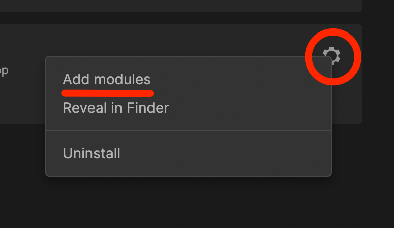
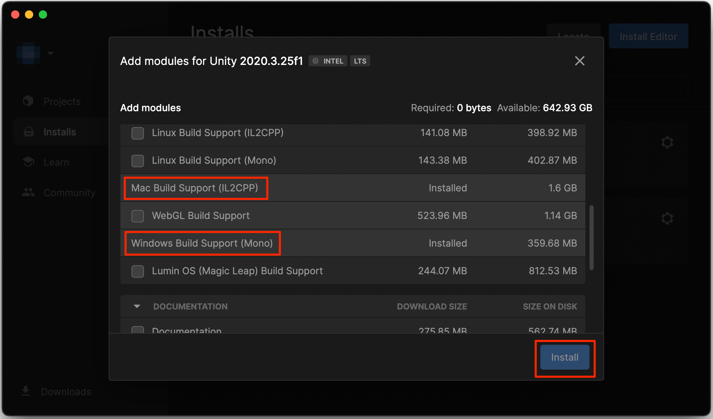

# Map creation for Kino  (WIP)

## Tnis guide will help you set up the enviroment and start creation custom maps for KINO bundle map loader.

## List of contents:

* [Requirements](#req)  
* [Preparations](#prep)  
  * [Unity installation](#unity_install)  
  * [Installation of KinoMap SDK](#kino_map_sdk)  
  * [Setting up the KinoMap SDK project](#kino_map_sdk_open)  
* [Preparation for KINO map creation](#kino_map_prep) 
  * [Editor lighting](#kino_map_lighting)  
  * [Creation of the map scene](#kino_map_scene)
  * [Importing the map content](#kino_map_model)
* [Important notes regarding map's structure](#kino_map_important) 
* [Setting up the map's structure](#kino_map_struct_setup) 
  * [Surfaces](#kino_map_surfaces)
  * [Prefab unpacking](#kino_map_unpack)
  * [Map structure](#kino_map_struct)
  * [Optimization](#kino_map_optimization)
* [Colliders](#kino_map_colliders) 
* [Spawn points](#kino_map_waypoints) 
* [Rigid bodies](#kino_map_rigid_bodies) 
* [MapTool and building the map asset bundle](#kino_map_tool) 
  * [MapTool](#kino_map_tool_about) 
  * [Building the map asset bundle](#kino_map_build) 

#
 
## Requirements
* Unity editor `2020.3.25f1`
* 3D modeling software

#
 
## Preparation
 
### Unity installation.
First of all you need to install Unity Hub. You can download it using the following link:  
https://unity3d.com/get-unity/download  
Then click on the **Download Unity Hub** button, download and install it.
  

#

Now let's get to Unity installation. Currently the game uses `2020.3.25f1` version of Unity Editor.  
You can download it using the following link:  
https://unity3d.com/get-unity/download/archive

Here you need to choose the required version. Currently that is `2020.x`
  
Then find `Unity 2020.3.25f1` in the list and click on the **Unity Hub** button.

  

After the installation the required editor should appear in the list.  

  

Then you need to install additional modules for building the asset bundle for **Windows** and optionally for **OSX**  
To do that select the required editor and click on the **gear** then click on **Add modules**.

  

Remove the check mark from **Visual Studio**, if you don't need it.

  

Then add the **Windows Build Support** and optionally **Mac Build Support** components, then click on **Install**.

  

Unity installation is complete!

 
### KinoMap SDK installation  
Currently **Kino** map creation tools are in a form of a Unity project.  
You can download the tools using the following link:  
https://github.com/trbflxr/kino_map_sdk  
  
You can download the project using **Git** or as a **.zip** file.
* Installation using git **git**: `git clone https://github.com/trbflxr/kino_map_sdk`
* Installation using **.zip** file: click on the **Code** button, then **Download ZIP**
  

Project is downloaded. Now we can get to setting up Unity.

 
### KinoMap SDK project set up  
First of all you need to add the project to **Unity Hub**. To do that open **Unity Hub** and click on **Open** button.  
In the explorer state the path to `kino_map_sdk`.  
As a result the project will appear in the list. Double-click on it to start up the editor.
  

 
## Preparation for map creation

 
### Lighting in the editor
The project has a **Lighting** scene in the folder **Assets/Scenes**. Drag and drop it to the **Hierarchy** tab, in order for the editor lighting to work.  
**This is an optional step**, to have a rough understanding on how the lighting on the map is gonna look in the game.  
You can set up this scene however you like. It will only work in the editor and won't show up in the game.
  
 
### Map scene creation
To create a new scene click on the **File** and then click on **New Scene**.  
Or use `Ctrl + N` shortcut for **Windows** and `Command + N` for **OSX**.  
  

Then you need to select an emtpy scene **Empty (Built-in)** and press **Create**  
  

Empty scene is created, now save it using **File** and then **Save**.  
Or use `Ctrl + S` shortcut for **Windows** and `Command + S` for **OSX**.  
We saved the scene in the folder **Assets/Scenes**, however you can save it in any folder in the project that works for you.
  

 
### Adding the map content
It is implied that the project will be used to create multiple maps within the same project instead of creating separate projects for every map. So create the **Assets/Resources** folder with **your map's name**, that's going to store all the assets for it.
This step is optional and is needed for a better project structure and won't affect the final product.  
In the example we created the folder **NewMapTest**.  
  

Let's start filling it up with assets.  
From this point on you can add any assets to the projects and use it across all the maps you're making.  

Let's look at the example of importing am **.fbx** model and **textures** for it. Transfer all the needed files to the map's folder.
  

Now drag and drop the model to the scene.  
  
At this point the model is most likely pink and has no material.  

Create the folder for materials. We created it inside **NewTestMap** and named it **materials**.  
  

Next step is to extract the materials. To do that select the model inside the **Project** tab, then go to the **Inspector** tab, select **Materials** and click on **Extract Materials...**. Then extract the materials to the folder created earlier.  
  
Now the model should appear correctly and we can get to adjusting materials settings if needed.  
  

 
## Important notes regarding the map structure
Map for **Kino** should have any any light sources that belong to the **Directional Light** type, and should have any **Volume** components. Also they shouldn't have any cameras on them.  

 
## Setting up the map structure  

 
### Surfaces
Currently Kino support the following types of surfaces:
  * road
  * grass
  * dirt
  * gravel
  * sand
  * ice
  * snow
  * kerb

 
### Unpacking the prefab
First you need to **unpack** the prefab. To do that right click on the prefab then select **Prefab** -> **Unpack**.
  

 
### Map structure
Let's get to setting up the map's structure.  
This part is very easy. Road surfaces go to the **road** object, grass in the **grass** object and so on.  
Add the object to the scene and name it [surfaces](#kino_map_surfaces).
  

In the example we created **Empty** objects **road** and **grass**. Then we moved all the surfaces that the game should treat as **road** and as **grass**.  
  
Objects of the other types are structured using the same principle.  

 
### Optimization
Then we need to select all the static objects, for an example **roads**, **poles**, **building** and give them the **Static** flag.  
  

 
## Colliders 
To process the collisions map should have the colliders set up.  
Select **all** objects, that should have a **collider** and add the **Mesh Collider** component to them.
  
In the examples we **only** gave colliders to **road** and **grass**. In the process of map creation, colliders should be given to **all** the objects that should have a collision.  

 
## Spawn points 
To add spawn points you need to create **Empty** objects named **waypoints** In the scene's hierarchy. Then add the spawn points there. The first point in the list is gonna be spawn points. All of these points will be accessible from the **Waypoints** tab of the mod.  
  

 
## Rigid bodies  
To add a dynamic **RigidBody** ojbect, create an **Empty** object called **rigid_bodies** in the scene's hierarchy.  
Add all the dynamic objects inside of it. Also make sure that all the objects inside **rigid_bodies** **DO NOT** have a **static** flag.  
Also you need to add the **RigidBody** component to all of the objects.  
  

After that you can get to setting up the object's parameters. Play around with the values to get the desired result.  

 
## MapTool and building the map asset bundle

To open the tool for map bulding go to **Kino** -> **MapTool**.  
  

The window that appears can be dragged to any of the editor's groups.  
  

 
### MapTool
The field **Creator name** is needed for the map creator's name.  
Bellow is the list of maps. The maps marked with a checkmark are the maps that will be built. Mark only the map you're working on currently. That way the other maps won't be rebuilt and it will speed up the process.  
Bellow you have a button **Add new map entry**, that allows to add a new map to the list. To remove a map from the list click on **Remove '<map_name>'**.

Then you have **Reload cache** and **Wipe cache** buttons, Which are needed for realoding and deleting the maps' cache. Maps' cache is stored inside **Assets/Build/map_cache.knd** and is needed to save the current state of the tool.  

Buttons **Build for all platforms** and **Build for '<platform_name>'** is responsible for bulding the map only for the current platform or for all the platorms. Build the map for all platforms only for the final testing or for publishing the map. This will speed up the development process.
  

 
### Building the map
To build the map fill up the **Creator name** field. Then add a new map to the list if you haven't already.  
Mark the map you want to build with check marks and fill up the fields.  
State the name of the map in the **Map name** field.  
Drag and drop the map's scene to the **Scene** field, in the example bellow it is the **NewMapTest** we created earlier.  
**Load screen** field is intended for the pictures that are going to be used for the loadscreen. Drag and drop the pictures in **.png** or **.jpg** formats that you want to use inside the field.  

And finally to assemble the map click on **Build for all platforms** or **Build for '<platform_name>'**.  
The final result is located inside the **Build** folder, that you can quickly open from the menu using **Kino** -> **Open maps folder**.
  

As a result you're gonna have maps for the selected platforms. They can be loaded using **Kino**.
  